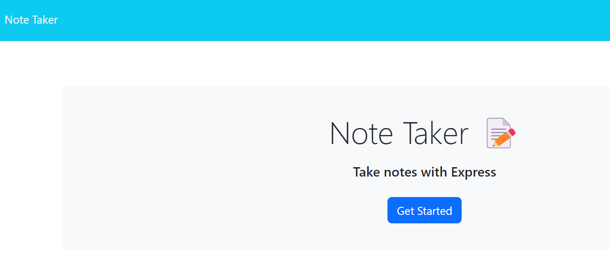
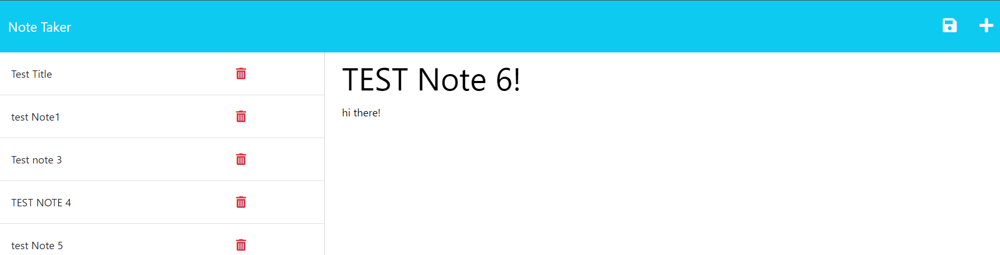

# Note Taker App

## Description

This project is a note-taking app, built from starter code at https://github.com/coding-boot-camp/miniature-eureka. It stitches together the front-end starter code with a back-end using Express. Enjoy using the app!

## Installation

Run 'npm i' to install the Express package in the package.json file if you are running this via VS Code. Otherwise, you can run the app via Heroku here:  https://notetakerapp01-e3c999801cbe.herokuapp.com/ 

## Usage

Click the 'Get Started' button to go to the interactive note-taking page! Fill in some text and then save your note. You should also be able to delete your notes as well!

## Credits

Columbia University Coding Bootcamp

## License

MIT License

## How to Contribute

Follow the [Contributor Covenant](https://www.contributor-covenant.org/)!
